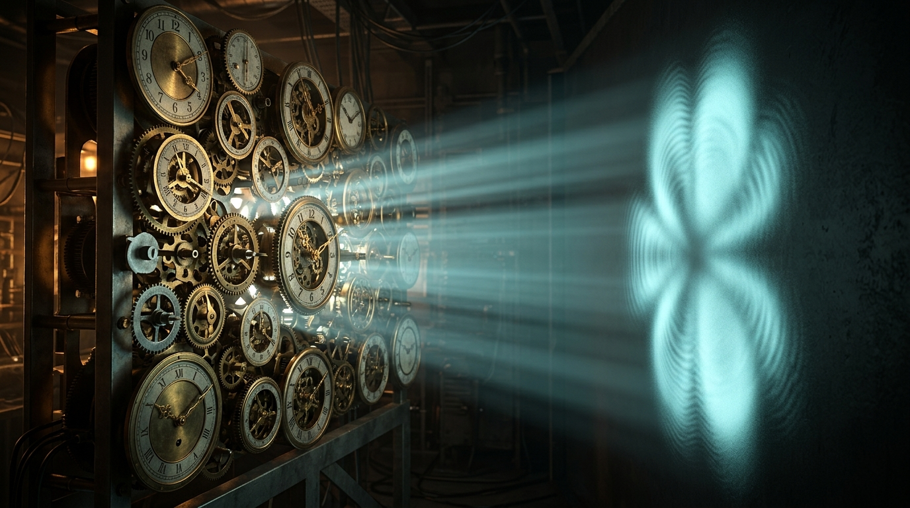
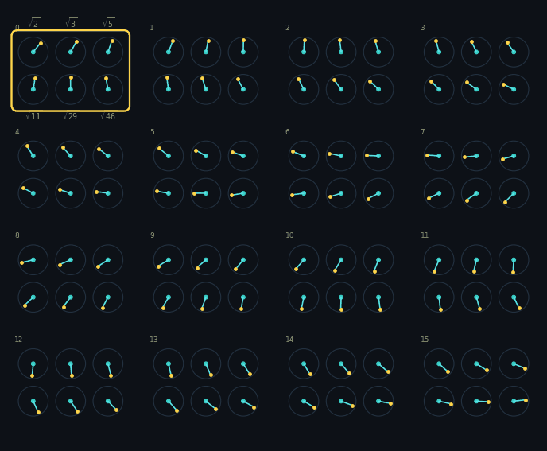
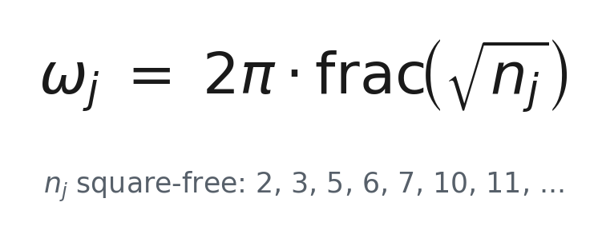
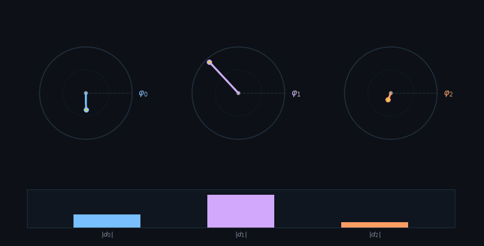
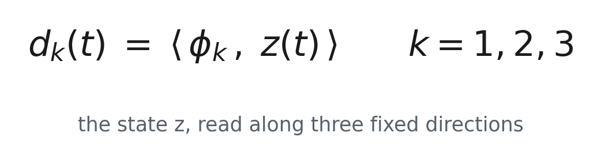
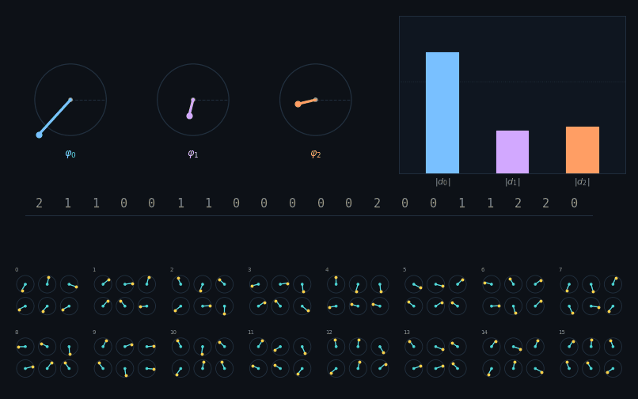
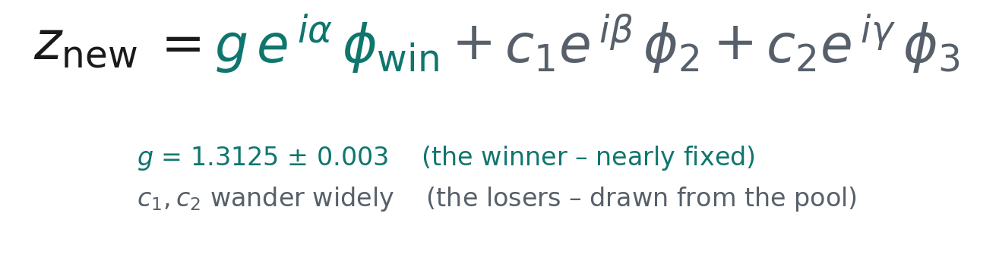

# The Machine

*Quest for Entropy #2: how a clockwork with no dice fakes quantum mechanics — the machine taken apart, the exam it passed, and the one wall it cannot get past.*

<!-- The clockwork on the left, its shadow on the wall at right. The machine is ordinary; the shape it throws is not. -->

In episode one we showed a machine and made a claim. It is a clockwork, fully deterministic — no dice anywhere. A small observer lives inside it. And the numbers that observer writes down, when it measures, come out looking quantum. Not by luck, and not by using the quantum formula. Just by counting what happens.

We showed *that* it works. We didn't show *how*. This time we take the machine apart — its three moving parts — and then we put it to a test: a twenty-question quantum exam. It passes almost all of it. Then we show the one place it fails, on purpose, in a way you can check.

## The question

First, why anyone would expect this to be possible at all.

Quantum mechanics is famously hard to picture. Things are in two places until you look. Looking changes the answer. Particles far apart seem to agree instantly. Generations of clever people have failed to make it feel ordinary, and most physicists have made peace with it never feeling ordinary.

Here is another way to hold that strangeness. **Imagine a room where you can only ever see shadows on a wall, never the objects casting them.**

The shadows would behave oddly. One shrinks to nothing and comes back. Two separate objects throw a single shadow, and you cannot tell there were ever two. An object turns steadily, and its shadow seems to stop, reverse, stretch. Two completely different objects cast shadows you cannot tell apart.

Nothing is wrong with the objects. They are ordinary, moving in ordinary ways. The strangeness lives entirely in what a flat wall can show you — because a shadow **throws information away**, and once it is gone, the shadow's behaviour stops making sense on its own terms.

That is the bet of this whole series: that quantum strangeness might be shadow strangeness. Not a bizarre reality, but an ordinary one seen through something that loses information on the way. The machine below is a small, honest example of exactly that — a plain clockwork, and an observer inside it who never gets to see the objects, only what falls on the wall.

Now the rules, because the machine obeys all of them at once.

Bell's theorem killed local hidden variables, so any hidden machinery has to be *global*. Space, time, and the speed of light are the visible tip of a hidden iceberg — so things far apart can share hidden state without sending a signal. Nothing underneath is ever destroyed: run it backward and every state comes back. And every probability is *counted* from events, never computed from a quantum formula. The formula shows up only at the end, as a line to compare against.

Under all of it sits one character — the star of this whole series. The **bounded observer**: small memory, small compute, living inside something much bigger than itself. To an observer like that, a rich enough machine does not look like a machine. It looks like dice.

## The hidden clockwork

At the bottom of the machine sits a clockwork. Not chaos — a clockwork. A pool of **rotors**, each turning steadily at its own speed, forever. Ninety-six of them, in sixteen groups of six.

One rule matters above all: **the speeds never line up.** No two rotors ever come back to the same spot at the same moment, so the pool never repeats itself. Not after a minute, not after a billion years.

Each speed is set by a square root — √2, √3, √5, √6, √7, and so on:

"frac" just means *keep the part after the decimal point*. Numbers built this way are guaranteed never to fall into step; that is an old, proven fact about square roots. Two details do real work:

- **Plain whole numbers would kill it.** Speeds of 2 and 3 come back together regularly. The pattern loops, and a looping machine is a dead machine.
- **The numbers under the root must be square-free** — 2, 3, 5, 6, 7, 10, 11, skipping 4, 8, 9, 12. Why? √4 is just 2, a whole number, which loops. And √8 is 2×√2, which is not a genuinely new speed: that rotor would stay locked in step with the √2 rotor forever, the two of them turning as one. Square-free is how you guarantee that every rotor you add brings a speed that never falls into step with any of the others.

**What is the pool actually for?** This is the part I had to go back and check in our own code while writing this, and the answer is simpler than I expected. The rotors do not build anything. They do not push anything around. They are consulted at exactly one moment — when a measurement happens — and they hand over six numbers. Then they carry on turning, completely untouched.

That is their whole job: **a supply of fresh numbers that never repeats.**

And that is where the apparent randomness comes from. The observer cannot see ninety-six free-running rotors, and it cannot guess which six numbers are coming next. From the inside, that unknown, never-repeating churn is indistinguishable from luck. There is no luck in it. There is only machinery the observer is too small to follow.

Why does "never repeats" matter so much? Because if the pool ever came back around, the measurements would fall into a repeating pattern and the whole illusion would collapse. It is also the fingerprint of quantum behaviour. Episode one's picture had two panels: a chaotic pendulum smearing into fog, and beside it a structured, woven pattern. Quantum mechanics is the woven one. Chaos smears. A cheap digital clock loops. Neither can make the weave. This can.

## The wave

Now the thing being measured.

The machine carries exactly one object, and the rest of this story is about that object. Call it **the state**.

The state is **three numbers** — three arrows, each with a length and a direction. That is the whole system. It is not a summary of the rotors and not a view of anything else: it is its own thing, held by the machine and updated as time goes on. Picture three numbers written on a whiteboard, where the whiteboard is the entire universe of this toy.

**And that is the probability wave** — the object physicists spend a career learning to calculate with. Not a metaphor for it. The same thing.

**Between measurements, it turns.** Steadily, lawfully, the way a quantum state turns. Nothing decides anything during this part; the state simply rotates and the machine leaves it alone.

**Now the shadows.** The observer cannot see the state. What it has instead are three fixed directions of its own — call it its **frame** — and it can only ask how much the state leans along each one. Three questions, three answers.

Those three answers are the shadows the state casts on the observer's wall. And they are lossy in exactly the way shadows are: the state could point many different ways and still throw these same three shadows. That gap — between what the state *is* and what the observer *gets* — is where every strange thing in this piece comes from.

**The frame never changes.** Chosen once, frozen, never re-tuned between measurements and never fitted to anything. That rule is load-bearing: if the observer could adjust its own frame per measurement, it could quietly fit its way to any answer it wanted, and nothing it produced would mean a thing. And it is not one lucky frame either — pick a fresh random one and the machine still works.

**Why exactly three?** This is the one number we had no freedom over, and the reason is worth slowing down for.

The observer can point its three directions any way it likes, so there are endlessly many possible measurements — and whatever rule turns arrows into probabilities has to work for *all of them at once*. Every complete set of directions must hand out probabilities that add up to 1.

Here is the part that does the work: **the same direction belongs to many different sets**, and it must be given the same probability in every one of them. It is a crossword. Each letter sits in an across word *and* a down word, and everything has to fit at the same time.

With only two options, nothing crosses. Each direction has one partner, its opposite; the pair adds to 1; and almost any rule you invent will do, because no other clue is holding it in place. From three options up, the crossings appear everywhere and lock the puzzle — and Gleason proved that exactly **one** rule survives them all: the **squared length** of the arrow. Not a rule anyone chose. The only one that fits.

That is ordinary mathematics, not our result. What is ours is the decision to build at three — the smallest size where the squared law stops being a choice.

## The fold

This is the heart of the machine. Let me walk through one real measurement — the thousandth one in a run — with the machine's own numbers.

**Compare.** The three arrows have lengths 1.425, 0.378 and 0.417. The observer takes the longest. The first one wins.

**Record.** It writes down one number — **which arrow won**, and nothing else. Not the length. Not the angle. Just the label of the winner. That single number is the entire record of the event.

This is the shadow at its most extreme. The state was six numbers' worth of detail; the three arrows were already a lossy view of it; and now even those collapse to a single digit. The observer is not being told what happened. It is being told *which of three things* happened, and nothing else — and from that thin diet it has to build its whole picture of the world.

Does the machine need to keep it? No. It uses that number once, immediately, to decide which way the next state should lean — and then it can forget it. The long row of integers you see in the picture is *our* notebook, not the machine's. We keep it because we want to count how often each answer comes up. The machine itself carries only the state.

Keep two things apart here: the **result** is that integer, and the **new state** is what the system becomes next — a consequence of the measurement, not the measurement itself.

**Rewrite.** Now the state must be replaced, and this is where the rotors finally do their job.

A state is three complex numbers, and a complex number is a size and an angle. So a state is exactly **six real numbers**: three sizes and three angles. To write a new one you need six fresh numbers — no more, no fewer.

So the machine asks the pool for six plain numbers: six rotor positions. It never needs all ninety-six. And it takes them in strict rotation — the first measurement reads group one, the second reads group two, and so on around the sixteen groups before starting again. This was the thousandth measurement, and a thousand divided by sixteen leaves eight, so it read group eight.

Why a fixed rotation? Two reasons. Two measurements in a row then draw on different rotors, so one reading tells you almost nothing about the next. And the choice never depends on what was just measured — if the machine picked its rotors according to the answer it had just got, the pool would start echoing the system instead of staying independent of it.

Does it come back around after sixteen measurements, then? It returns to the same *rotors*, never to the same *numbers* — by then those six have turned on by an amount that never brings them home, and never will.

**And why groups at all** — why not one big set of rotors, blended together and read whenever numbers are needed? We built that version first, and it failed. The fold makes two demands that pull against each other: matching the quantum law wants numbers carrying rotation-like structure, while keeping the records free of memory wants numbers unrelated to one another. One source cannot do both — we measured the trade-off in both directions. Separate groups deliver both at once.

Three of the six numbers set the sizes. The other three set the angles. Only now do they pair up into complex numbers: the complex-ness is assembled from six ordinary readings, not pulled out of the pool.

And notice what these numbers are *not*. There is no random number generator anywhere in this machine — there couldn't be, or the whole point would be lost. These aren't even pseudorandom, in the sense of an algorithm designed to look random. They are the positions of wheels turning at steady speeds: about the least sophisticated thing imaginable. Reading them is like reading a bank of clock faces. Perfectly predictable — *if* you could watch ninety-six hands at once and knew every speed. The observer can't. That is the entire trick.

The winner's direction gets a big size — 1.31. The two others get smaller ones — 0.93 and 0.50. Each gets its angle from the pool. **Those three sizes and three angles are the new state.** And you see it straight away: the three arrows now measure exactly 1.31, 0.93 and 0.50. The arrows *are* the state.

**What got overwritten?** The three numbers on the whiteboard. The old three are wiped, three new ones take their place. That is all "the old state is gone" means — the machine simply no longer holds it.

Nothing was destroyed in a deep sense. If you knew the record *and* where all the rotors were standing, you could work your way back to the old state. But the observer knows neither of those things. So for the observer, it is gone for good.

**And the rotors?** Untouched. They advance exactly as they would have if nothing had happened. We checked this to the last decimal place: the pool's path is identical whether the observer measures or not. The observer has no effect on the clockwork at all.

**Then life goes on.** The new state turns, the way it always does, until the next measurement — and the same thing happens again. There is no restart and no reset in between. It is one continuous life: turn, measure, rewrite, turn, measure, rewrite, tens of thousands of times in a single run.

So: no collapse rule, no dice, no formula. Compare three lengths, keep one integer, rewrite from the pool.

Two things fall straight out of that single rewrite.

**One: measure again and you get the same answer.** The new state leans toward what was just recorded, so the same arrow is still the longest. Measure twice in a row, get the same result — 177,000 times out of 177,000 when we counted it. That is the collapse postulate, and we never wrote it down anywhere. It falls out of the lean.

Notice what is *not* frozen, though. The second measurement draws six fresh numbers and writes another whole new state. **The state behind the answer is refreshed every time; the answer itself does not move.**

And if the observer *waits* instead of measuring again immediately, the certainty fades. The state keeps turning while it waits, the lean stops pointing where it did, and the answer blurs back out — along the curve quantum mechanics predicts, dip and partial revival included.

**Two: the observer cannot go backwards.** The old state is unreachable and the new one is built from numbers it never saw. It cannot undo the measurement, and it cannot predict the next one.

**How far does it lean?** The winner's size is almost perfectly pinned — very nearly the same value every time. The losers' sizes *wander* widely: in the event above, 0.93 and 0.50, but across many measurements they roam from almost nothing to nearly the winner's size. So the winner sits about **two and a half times** the losers on average, while single events scatter well above and below that.

Lean too little and the machine keeps no memory of what it saw, so the counts come out classical. Lean too hard and it goes rigid, and the quantum pattern on the *next*, different measurement breaks. In between there is one setting that works — and it is not a knob we were free to pick. It can be derived from the geometry, and when we did that, the number the maths puts there is the number an optimizer had found hundreds of experiments earlier. That derivation is a story for another day; here it is enough to know the lean is forced, not chosen.

**Watching versus touching.** Now the switch that matters most. Run the same machine two ways:

**WATCH** — the observer reads the arrows, writes down the winner, and changes nothing else. The statistics it counts come out **classical**.

**FOLD** — the observer reads, writes down the winner, *and rewrites the state*. The statistics come out **quantum**.

Same rotors, same frame, same "pick the longest" rule. The only difference is whether the reading rewrites anything.

Watching can never work, and that is a theorem, not bad luck: an observer that only looks is sampling a machine that was going to do that anyway, so it reads out ordinary classical statistics no matter how exotic the machinery underneath. Touching works because the next measurement then starts from a state that has been re-set to agree with what was just seen.

**Classical is looking without touching. Quantum is looking by touching.**

And you can watch this do its most famous trick: the double slit. With the fold switched off, the counts pile up into stripes — interference. Switch it on, so the machine reads which slit the particle went through, and the stripes die into two plain lumps. In this machine the "observer effect" is not magic and needs no consciousness. It is a rewrite. You can play with it yourself — the link is below.

## The whole machine

That is the entire thing. Written out as a loop:

> **a state** — three numbers on the whiteboard
> **compare** — which of the three arrows is longest?
> **record** — write down one integer: the winner
> **draw** — six fresh numbers from the next group of rotors
> **rewrite** — a new state, leaning toward the winner
> **turn** — and round again

No dice. No collapse rule. No quantum formula anywhere inside it. A clockwork that never repeats, an observer too small to follow it, and a measurement that cannot help but disturb what it measures.

## The run

So does it actually work?

We wrote down a twenty-question quantum exam — Born statistics, interference with the right shape, the decoherence law, repeatability, delayed choice, the quantum eraser, the trade-off between knowing the path and seeing the stripes — and made the machine sit it. Every question had a pass mark fixed before anything ran, and a mark could be made harder later, never softer.

**It passed eighteen of the twenty.** And the two that didn't pass are more interesting than the eighteen that did.

That is episode three: the exam in full, question by question, with the numbers and the failures in the open.

## The Confession

The confession for *this* episode is not about what the machine gets wrong. It is about how it was built.

**The recipe was found by an optimizer, not derived from first principles.** We wanted counted statistics that matched the quantum law, we searched for settings that produced them, and we found some. That is engineering, and we call it engineering. The lean, the sixteen groups, the choice of three outcomes — every one of those was a decision, tested until it worked.

Two things stop that from being fatal. First, the quantum formula appears **nowhere inside the machine** — nothing is ever squared, no probability is ever computed. It compares three lengths and writes one integer. The squared law appears only when *we* count events afterwards, which means the machine cannot be quietly copying the answer it is meant to produce. Second, the lean turned out not to be free after all: work out the geometry and the number falls out on its own, exactly where the optimizer had landed.

Still, the honest version stays honest. This is a machine we built to behave a certain way, and it does. Whether nature does anything of the sort is not a question this piece can touch.

**And it does fail somewhere.** There is a specific, measurable thing this machine cannot do that quantum mechanics can. We know what it is, how big it is, and why it has to be there — and that is the heart of the next episode, because a failure you can measure is worth more than a success you cannot check.

## What this does NOT claim

> This is a **demonstration**, not a discovery about nature. It does not say our universe is a clockwork, does not reinterpret quantum mechanics, and does not dodge Bell's theorem — the hidden machinery is *global*, not local, exactly because Bell rules out the local kind (we checked). The recipe was found by an optimizer and only later shown to sit at a fixed point of the geometry; the build is engineering, and we say so. The claim is only this: quantum-looking behaviour *can* come out of a deterministic machine plus a physical measurement — not that this is *why* our world is quantum. Everything here describes one family of machines at the settings we tested, and where it fails, it fails in public.

## The neighbors

This corner of ideas has serious residents, and episode one's honest note still holds: the reading and cross-checking was done mostly by AI, with me steering. Gerard 't Hooft's [Cellular Automaton Interpretation](https://arxiv.org/abs/1405.1548) is the closest neighbour in spirit — quantum mechanics sitting on a deterministic layer — though his layer stays local and meets Bell a different way than our global iceberg. [Bohmian mechanics](https://plato.stanford.edu/entries/qm-bohm/) proved in 1952 that a deterministic-but-nonlocal quantum mechanics can exist; the difference is cost, since Bohm carries the whole wavefunction as hidden machinery while this asks how *cheap* the hidden layer can get. Wojciech Zurek's [decoherence](https://arxiv.org/abs/quant-ph/0105127) is the textbook mirror of the way a measurement here puts things beyond reach. And Jacob Barandes' [indivisible stochastic processes](https://arxiv.org/abs/2402.16935) describe measurement as a single unsplittable jump — our fold, in the language of probability — making this machine a candidate for the deterministic version his picture deliberately leaves open.

## Run it yourself

Poke the machine in your browser, no install. **[Run the machine yourself](https://quest-for-entropy.web.app/the-machine)** — press measure and watch one fold happen step by step, then flip FOLD to WATCH and see the counts change in front of you. And **[watch the fold kill the stripes](https://quest-for-entropy.web.app/stripes-die)** — the double slit, with a switch for the fold. Both run live in your browser on the same algorithm as the laboratory code, checked against it digit for digit. Everything counted in this post also reproduces from a companion repository with one command: **[github.com/masteris777/quest-for-entropy-the-machine](https://github.com/masteris777/quest-for-entropy-the-machine)** — `python run_all.py` runs the machine itself and regenerates every number in this post.

## How this was made

I'm a software architect. The physics and the deep math are what I'm curious about, not my job, and I use AI to explore them. The honest split: the heavy lifting — the math, the physics checks, the code, the sums — is AI, with me setting the direction, asking the questions, and making the calls. Main models: Anthropic Fable 5 and Sonnet 5, with help from OpenAI GPT 5.6 Sol, DeepSeek v4 Pro, and Google Gemini 3.1. To keep us honest, the work runs through a harness I built: every experiment follows rules fixed in advance, results get challenged by independent AI review, and every mistake we catch — including the five in this post — goes into a public honesty ledger. Every number here comes from code you can run, not from a model's memory.

## Next time

Episode three: **the machine sits a twenty-question quantum exam.** What we asked, what it did, and every number — including the one place it cannot follow quantum mechanics, how far short it falls, and why that gap looks like a law rather than a bug — though we have not proved that it is one.

---

*Quest for Entropy is written by Marijus Masteika. Entropy was always the dark horse for me — connected to information, and maybe hiding answers to everything. That's the quest.*
